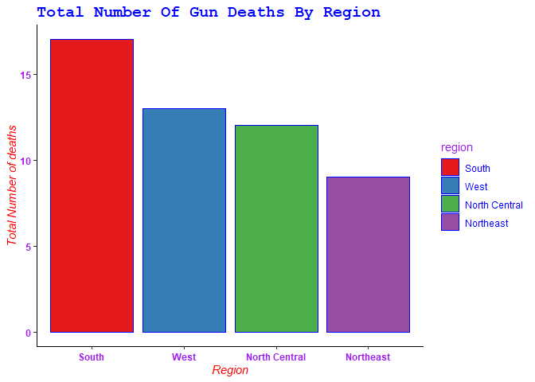
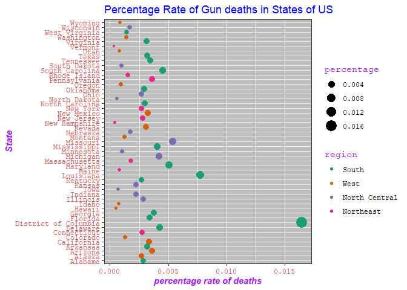

# MURDERS IN UNITED STATES
by Berndatte

## Synopsis
This paper makes an attempt to explore the US gun murders by state for 2010 to answer some basic questions about murders in US. It uses data from FBI reports which is found in 'dslabs package' in R.It also contains the population of each state.It employs exploratory analysis to find out which region has the highest rate of deaths and which state is leading in murders and which one has less murders.

## Loading Data,loading packages and Processing of data 
we load the package containing the 'murders' data set, then load data and all the packages needed for this analysis.


```r
knitr::opts_chunk$set(echo = TRUE)

library(dslabs)
data(murders)

library(ggplot2)
library(tidyverse)
```

```
## -- Attaching packages ------------------------------------------------------------------- tidyverse 1.3.0 --
```

```
## v tibble  2.1.3     v dplyr   0.8.4
## v tidyr   1.0.2     v stringr 1.4.0
## v readr   1.3.1     v forcats 0.4.0
## v purrr   0.3.3
```

```
## -- Conflicts ---------------------------------------------------------------------- tidyverse_conflicts() --
## x dplyr::filter() masks stats::filter()
## x dplyr::lag()    masks stats::lag()
```

```r
glimpse(murders)
```

```
## Observations: 51
## Variables: 5
## $ state      <chr> "Alabama", "Alaska", "Arizona", "Arkansas", "California"...
## $ abb        <chr> "AL", "AK", "AZ", "AR", "CA", "CO", "CT", "DE", "DC", "F...
## $ region     <fct> South, West, West, South, West, West, Northeast, South, ...
## $ population <dbl> 4779736, 710231, 6392017, 2915918, 37253956, 5029196, 35...
## $ total      <dbl> 135, 19, 232, 93, 1257, 65, 97, 38, 99, 669, 376, 7, 12,...
```

```r
murders$region <- factor(murders$region,
                         levels = c("South", "West", "North Central", "Northeast"))
```

## RESULTS
Addressing the first question,which region of US has the highest rate of gun deaths.

```r
ggplot(murders, aes(region, fill = region)) +
  scale_fill_brewer(palette = 'Set1') +
 geom_bar(color = "blue") +
 labs(x = "Region", y = "Total Number of deaths", title = "Total Number Of Gun Deaths By Region") +
  theme(panel.background = element_blank(),
        axis.line = element_line(color = "black"),
        axis.title = element_text(face = "italic", color = "red"),
        axis.text = element_text(face = "bold", color = 'purple'),
        plot.title = element_text(family = 'mono', face = "bold", color = "blue", size = 15),
        legend.title = element_text(color = 'purple'),
        legend.text = element_text(color = 'blue'))
```

<!-- -->

we see that the South region has the highest gun deaths followed by West then North Central and the region with the lowest rate of gun deaths.

Addressing the next question to find out which state has the highest percentage rate of deaths and which one has the lowest percentage rate of deaths

```r
murders %>%
  mutate(percentage = (total/ population) * 100) %>%
  arrange(desc(percentage)) %>%
  ggplot(aes(percentage, state, color = region, size = percentage)) +
  geom_point() +
  labs(x = 'percentage rate of deaths', y = 'State', title = "Percentage Rate of Gun deaths in States of US") +
  scale_color_brewer(palette = "Dark2") +
  theme_bw() +
  theme(plot.title = element_text(color = 'blue'),
        axis.text = element_text(family = 'mono', color = "indianred"),
        legend.text = element_text(family = 'mono'),
        legend.title = element_text(family = 'mono', color = 'purple'),
        axis.title = element_text(face = 'bold.italic', color = 'purple'),
        panel.background = element_rect(fill = 'grey'))
```

<!-- -->

we see that, District of Columbia is leading with the highest percentage rate of gun deaths in United states and Vermont is the state with the lowest percentage.

## conclusion
If you are new in United states you would not prefer to leave in District of Columbia due to its high rate of gun deaths.you will prefer to stay in the states with total gun deaths less than 10 like Vermont, North Dakota, Wyoming, New Hampshire, Hawaii or South Dakota.
